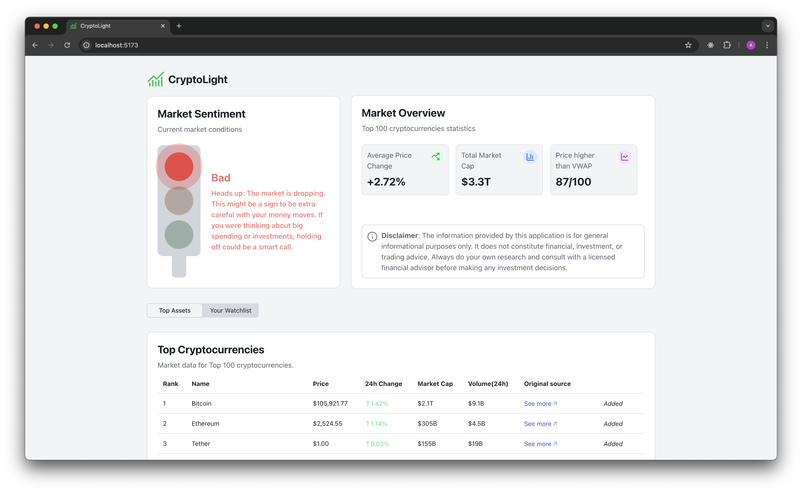
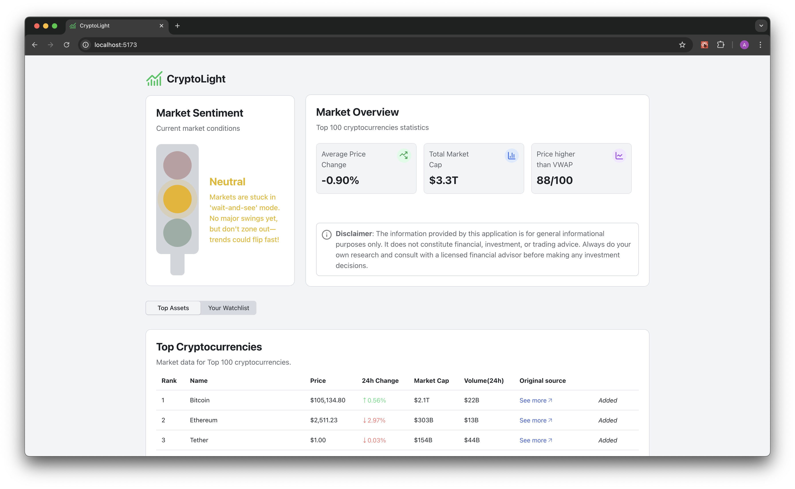
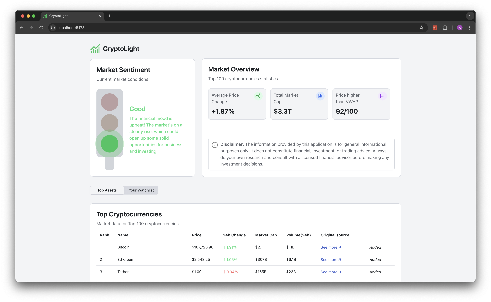

# 🚦 CryptoLight

## Motivation

CryptoLight is a place where anyone can get a quick snapshot of the crypto market over the past 24 hours and make informed decisions. The analytics are based on calculated metrics from the Top 100 coins.

The main goal of the project is to give everyone the ability to make investment decisions without needing deep knowledge of the crypto market. That said, the app might show some metrics that only more experienced crypto investors will fully appreciate.

The app analyzes the market and shows a simple traffic light—basically answering the question: 'Is today a good day to invest in crypto?'

- 🔴 - Not a good time to invest
- 🟡 - Market is neutral: could be worth waiting, or for some, a good time to jump in
- 🟢 - A favorable time to invest

The app is open to everyone—no sign-up required.

## About the app

**Key Features**:

- Shows a simple traffic light to help guide your investment decisions
- Lets you add assets to your personal watchlist
- Easily remove assets from your watchlist
- Your watchlist is saved, so it’s right there next time you open the app
- Browse the Top 100 cryptocurrencies
- View your customized watchlist anytime
- Get quick access to key crypto market metrics
- Instant notification if you lose internet connection

### Some screenshots

#### 🔴 light

#### 🟡 light

#### 🟢 light

## Usage

You can run project locally.

1. Clone this repository then `cd tickers-and-coins`
2. Install dependencies (e.g `npm install`)
3. Obtain api key for API https://pro.coincap.io/api-docs/
4. Create `.env` file with following content `VITE_API_KEY=<your api key>`
5. Run app by `npm run dev`

## How it works

Some quick facts:

- It uses [CoinCap API](https://pro.coincap.io/api-docs/) to fetch the latest market data.

- The watchlist is saved in localStorage, so it sticks around even after you close the app.

- The logic for computing market sentiment resides in the `MarketSentimentCard` component.

## Contribute

All contributions are welcome — big or small.

## Support

Got any issues? Just open one in the project and give me a heads-up.

## License

This project is licensed under the MIT License – see the [LICENSE](./LICENSE) file for details.
